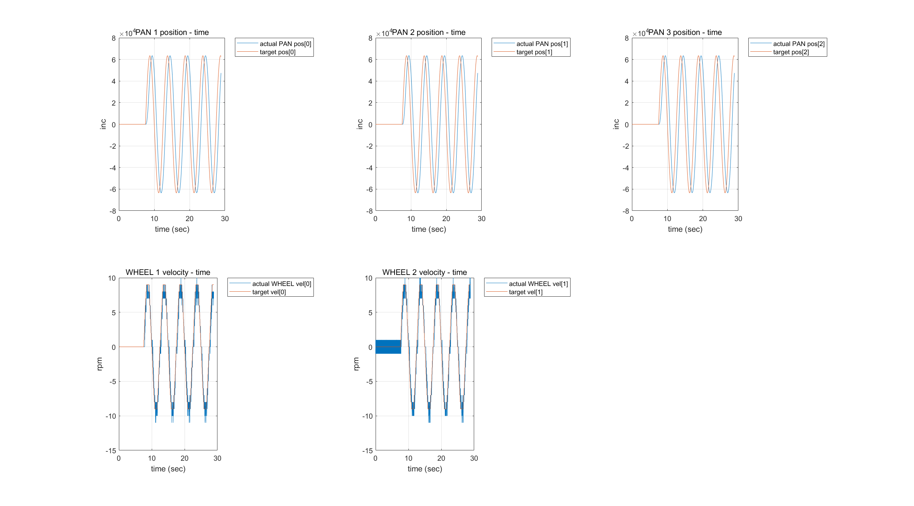

# ZUB_Client

Terminal 1
```
roscore
```

Run socket_comm_node.

Terminal 2
```
rosrun sock_comm socket_comm_node
```

Test node.

Terminal 3
```
rosrun sock_comm socket_comm_node_test
```

Information on msg_pkg/target.msg (LIFT, PAN, WHEEL)
|Type	|field name
|:---:|:---:|
|time| stamp
|int16[3]| target_torque
|int32[3]| target_pos
|int32[3]| target_vel


Information on msg_pkg/actual.msg (LIFT, PAN, WHEEL)
|Type	|field name
|:---:|:---:|
|time| stamp
|int16[3]| act_LIFT_torque
|int32[3]| act_LIFT_pos
|int32[3]| act_LIFT_vel
|int32[3]| act_PAN_pos
|int16[3]| act_WHEEL_torque
|int32[3]| act_WHEEL_vel

Images

